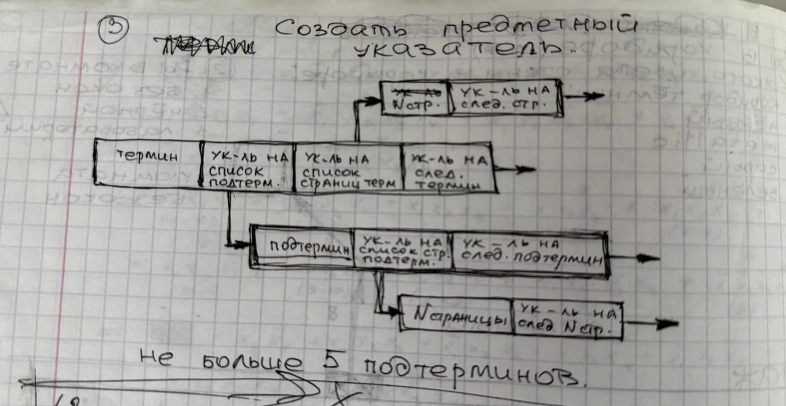

# Лабораторная работа №2

## Цель работы
Научиться строить словари и справочники на базе линейных списков и открытого хеширования данных.

## Задание
На основе динамических списков необходимо реализовать словарь (справочник). Основные операции, выполняемые над данными словаря: поиск, вставка и удаление. В сочетании со списками для построения словарей удобно использовать открытое хеширование данных, позволяющее фиксировать время выполнения операторов над словарем, а также сделать потенциально бесконечным пространство для хранения данных. Тематическое содержание словаря - языки программирования.

- Сортировка
- - по алфавиту и номеру страниц, не смешивать между собой термины и подтермины) (один подтермин может относиться к нескольким терминам - вывести все)
- Поиск (поиск термина по подтермину, подтермина по термену.
- Минимальная вложенность 3: термин->подтермин->подтермин)